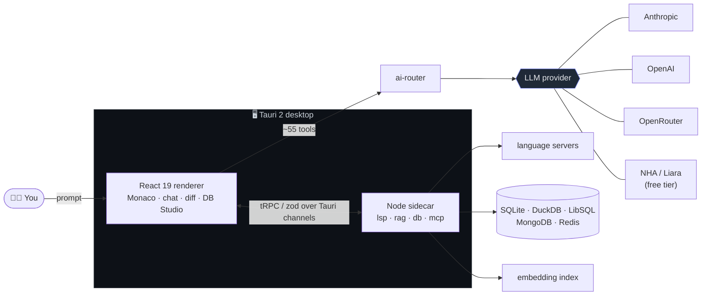

<div align="center">



<br/>

**A desktop AI coding IDE.** An agent that reads, writes and refactors real projects on your machine — with a GUI editor, integrated language servers, semantic code search, an embedded database studio and bundled dev-server runtimes.

<br/>

[](LICENSE)


<samp>Built by <b>Nicola Cucurachi</b> — the model, the Rust core, the tools. Everything here is his work.</samp>

</div>

---

## ✦ Why WebCraft

Most AI coding agents live in the terminal. **WebCraft is a real desktop IDE** where the agent works *inside* the editor:

<table>
<tr>
<td width="50%" valign="top">

**🖥️ A real IDE, not a sandbox toy**
Monaco editor · LSP hover / go-to-def / diagnostics · command palette · integrated PTY terminal · git sidebar · live red/green diff stream.

**🗄️ Database studio, built in**
Query, design and browse **SQLite · DuckDB · LibSQL · MongoDB · Redis** — embedded, zero installer.

</td>
<td width="50%" valign="top">

**▶️ Runs what it builds**
Bundled dev-servers: **Node · Bun · Deno · Go · PHP** — no PATH wrangling.

**🔓 No cloud lock-in**
Provider-agnostic routing — **Anthropic · OpenAI · OpenRouter · NHA/Liara (free tier)**. Keys live in the OS keychain, never in files or the repo.

</td>
</tr>
</table>

It touches your **real filesystem, real language servers, real git repo**.

---

## ✦ Highlights

> 🧠 **~55 agent tools** &nbsp;·&nbsp; ✍️ **real LSP** &nbsp;·&nbsp; 🔎 **semantic `@codebase` search** &nbsp;·&nbsp; 🗄️ **5-engine DB Studio** &nbsp;·&nbsp; ▶️ **5 dev-server runtimes** &nbsp;·&nbsp; 🟢 **live diff stream** &nbsp;·&nbsp; 🗺️ **plan mode + task tracker** &nbsp;·&nbsp; 🔌 **MCP + skills**

---

## ✦ How it works



---

## ✦ Features

### 🖥️ The IDE
`Monaco editor` · `command palette` · `code lens` · `integrated terminal (PTY)` · `file tree` · `project-wide search` · `symbol outline` · `Problems panel` · `diff viewer` · `snippets` · `tool library`

### 🤖 The agent — ~55 tools

<details open>
<summary><b>Show the full tool set</b></summary>

<br/>

| Group | Tools |
|------|------|
| **📁 Files** | `read_file` · `write_file` · `edit_file` · `multi_edit` · `apply_patch` · `create_dir` · `move_file` · `copy_file` · `delete_file` · `get_file_stat` · `list_directory` · `glob` · `grep` · `notebook_edit` |
| **🧭 Code intelligence (LSP)** | `goto_definition` · `find_references` · `get_symbols` · `rename_symbol` · `format_file` · `get_imports` |
| **🩺 Diagnostics & run** | `get_diagnostics` · `lint_file` · `type_check` · `run_test` · `run_build` · `run_command` |
| **🔎 Semantic** | `semantic_search` (`@codebase`) |
| **🌿 Git** | `git_status` · `git_diff` · `git_log` · `git_show` · `git_blame` · `git_branches` · `git_commit` |
| **🗄️ Database** | `db_query` · `db_schema` · `db_table_data` |
| **🗺️ Planning & tasks** | `enter_plan_mode` · `exit_plan_mode` · `task_create` · `task_get` · `task_list` · `task_update` · `task_stop` |
| **⏰ Automation** | `cron_create` · `cron_list` · `cron_delete` · `schedule_wakeup` · `monitor` |
| **🔌 Extend** | `mcp_list_servers` · `mcp_invoke` · `skill_list` · `skill_invoke` · `subagent` |
| **🌐 Web & project** | `web_search` · `web_fetch` · `fetch_url` · `get_project_metadata` · `get_outdated_deps` |

</details>

---

## ✦ Architecture

```
apps/desktop/            Tauri 2 (Rust core) + React 19 renderer
packages/
  core/                  Renderer: Monaco editor, chat + diff, file-tree, terminal,
                         git, db-studio, dev-server, embeddings index,
                         command-palette, code-lens, outline, problems, tasks, settings
  server/                Node sidecar — modules/{lsp, rag, db, mcp}
  ai-tools/              Tool definitions
  ai-router/             LLM provider abstraction
  shared/                Types, zod schemas, IPC contracts
  design-system/         Radix-based components
```

<table>
<tr><th>Layer</th><th>Choice</th><th>Layer</th><th>Choice</th></tr>
<tr><td>Desktop shell</td><td>Tauri 2 (Rust)</td><td>State</td><td>Zustand 5</td></tr>
<tr><td>Node sidecar</td><td>Node 22 + ESM</td><td>IPC</td><td>tRPC v11</td></tr>
<tr><td>Frontend</td><td>React 19 + Vite</td><td>Monorepo</td><td>Nx + pnpm</td></tr>
<tr><td>Editor</td><td>Monaco</td><td>Tests</td><td>Vitest 3</td></tr>
<tr><td>Styling</td><td>Tailwind CSS 4</td><td>Lint/format</td><td>Biome 2</td></tr>
<tr><td>Components</td><td>Radix + Lucide</td><td>Secrets</td><td>@napi-rs/keyring</td></tr>
</table>

---

## ✦ Develop

```bash
git clone https://github.com/adoslabsproject-gif/webcraft.git
cd webcraft
npm install
npm run build:cli        # sidecar / core build
npm run desktop:dev      # Tauri dev window  (requires Rust + Node ≥ 20)
```

---

## ✦ Status

<samp><b>v0.1.0 — active development.</b> Core is in place: editor, agent + ~55 tools, LSP, semantic search, DB Studio, dev-servers, diff stream, git. Screenshots and packaged installers are coming. Issues and PRs welcome.</samp>

<div align="center">

---

<sub>MIT © 2026 <b>Nicola Cucurachi</b></sub>

</div>
